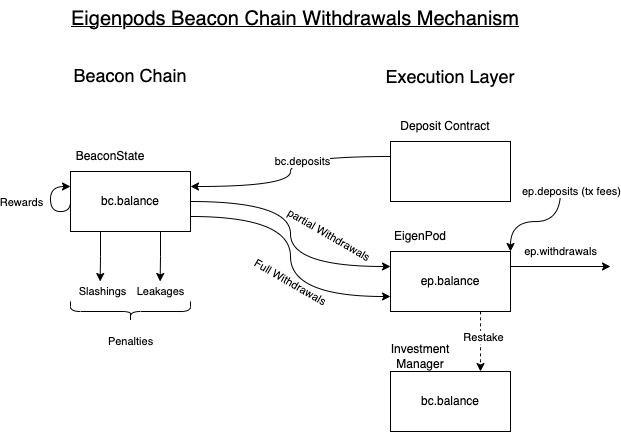

# EigenPods: Handling Beacon Chain ETH

## Overview

This document explains *EigenPods*, the mechanism by which EigenLayer facilitates the restaking of native beacon chain ether.

It is important to contrast this with the restaking of liquid staking derivatives (LSDs) on EigenLayer. EigenLayer will integrate with liquid staking protocols "above the hood", meaning that withdrawal credentials will be pointed to EigenLayer at the smart contract layer rather than the consensus layer. This is because liquid staking protocols need their contracts to be in possession of the withdrawal credentials in order to not have platform risk on EigenLayer. As always, this means that value of liquid staking derivatives carries a discount due to additional smart contract risk.

The architectural design of the EigenPods system is inspired by various liquid staking protocols, particularly Rocket Pool 🚀.

## The EigenPodManager

The EigenPodManager facilitates the higher level functionality of EigenPods and their interactions with the rest of the EigenLayer smart contracts (the InvestmentManager and the InvestmentManager's owner). Stakers can call the EigenPodManager to create pods (whose addresses are deterministically calculated via the Create2 OZ library) and stake on the Beacon Chain through them. The EigenPodManager also handles the 'overcommitements' of all EigenPods and coordinates processing of overcommitments with the InvestmentManager. 

## The EigenPod

The EigenPod is the contract that a staker must set their Ethereum validators' withdrawal credentials to. EigenPods can be created by stakers through a call to the EigenPodManager. EigenPods are deployed using the beacon proxy pattern to have flexible global upgradability for future changes to the Ethereum specification. Stakers can stake for an Etherum validator when they create their EigenPod, through further calls to their EigenPod, and through parallel deposits to the Beacon Chain deposit contract.

### Beacon State Root Oracle

EigenPods extensively use a Beacon State Root Oracle that will bring beacon state roots into Ethereum for every [`SLOTS_PER_HISTORICAL_ROOT`](https://github.com/ethereum/consensus-specs/blob/dev/specs/phase0/beacon-chain.md#time-parameters) slots (currently 8192 slots or ~27 hours) so that all intermediate state roots can be proven against the ones posted on the execution layer.

The following sections are all related to managing Consensus Layer (CL) and Execution Layer (EL) balances via proofs against the beacon state root brought to the EL by the oracle. The below diagram will be of great help to understanding their functioning.

## EigenPods before Restaking
When EigenPod contracts are initially deployed, the "restaking" functionality is turned off - the withdrawal credential proof has not been initiated yet.

### Merkle Proof of Correctly Pointed Withdrawal Credentials

After staking an Etherum validator with its withdrawal credentials pointed to their EigenPod, a staker must show that the new validator exists and has its withdrawal credentials pointed to the EigenPod, by proving it against a beacon state root with a call to `verifyWithdrawalCredentialsAndBalance`. The EigenPod will verify the proof (along with checking for replays and other conditions) and, if the ETH validator's current (not effective) balance is proven to be greater than `REQUIRED_BALANCE_WEI`, then the EigenPod will call the EigenPodManager to forward a call to the InvestmentManager, crediting the staker with `REQUIRED_BALANCE_WEI` shares of the virtual beacon chain ETH strategy. `REQUIRED_BALANCE_WEI` will be set to an amount of ether that a validator could get slashed down to only due to malice or negligence. 

### Merkle Proofs for Overcommitted Balances

If a Ethereum validator restaked on an EigenPod has a balance that falls below `REQUIRED_BALANCE_WEI`, then they are overcommitted to EigenLayer, meaning they have less stake on the beacon chain than they have recorded as being restaked in Eigenlayer. Any watcher can prove to EigenPods that the EigenPod has a validator that is in such a state, by submitting a proof of the overcomitted validator's balance via the `verifyOvercommittedStake` function. If proof verification and other checks succeed, then `REQUIRED_BALANCE_WEI` will be immediately decremented from the EigenPod owner's (i.e. the staker's) shares in the InvestmentManager. The existence of an overcommitted validator imposes a negative externality on middlewares that the staker is securing, since these middlewares will effectively overestimate their security -- proving overcommitment provides a mechanism to "eject" these validators from EigenLayer, to help minimize the amount of time this overestimation lasts.  Note that a validator with a balance of 0 ETH may be either withdrawn or, in the rare case, slashed down to 0 ETH.  In the case of the latter, we verify the status of the validator in addition to their balance.

### Proofs of Full/Partial Withdrawals

Whenever a staker withdraws one of their validators from the beacon chain to provide liquidity, they have a few options. Stakers could keep the ETH in the EigenPod and continue staking on EigenLayer, in which case their ETH, when withdrawn to the EigenPod, will not earn any additional Ethereum staking yield, but may continue to earn yield on EigenLayer. Stakers could also queue withdrawals on EigenLayer for their virtual beacon chain ETH strategy shares, which will be fullfilled once their obligations to EigenLayer have ended and their EigenPod has enough balance to complete the withdrawal.

In this second case, in order to withdraw their balance from the EigenPod, stakers must provide a valid proof of their full withdrawal or partial withdrawal (withdrawals of beacon chain rewards).  In the case of the former, withdrawals are processed via the queued withdrawal system while in the latter, the balance is instantly withdrawable (as it is technically not being restaked). We distinguish between partial and full withdrawals by checking the `validator.withdrawableEpoch`.  If the `validator.withdrawableEpoch < executionPayload.slot/SLOTS_PER_EPOCH` then it is classified as a full withdrawal (here `executionPayload` contains the withdrawal being proven).  This is because the `validator.withdrawableEpoch` is set when a validator submits a signed exit transaction.  It is only after this that their withdrawal can be picked up by a sweep and be processed.  In the case of a partial withdrawal, `validator.withdrawableEpoch` is set to FFE (far future epoch). 

We also must prove the `executionPayload.blockNumber > mostRecentWithdrawalBlockNumber`, which is stored in the contract.  `mostRecentWithdrawalBlockNumber` is set when a validator makes a withdrawal in the pre-restaking phase of the EigenPod deployment.  Without this check, a validator can make a partial withdrawal in D1 and then try to prove the same partial withdrawal in D2, thus double withdrawing (assuming that they have restaked balance in the EigenPod during the second withdrawal).

In this second case, in order to withdraw their balance from the EigenPod, stakers must provide a valid proof of their full withdrawal (differentiated from partial withdrawals through a simple comparison of the amount to a threshold value named `MIN_FULL_WITHDRAWAL_AMOUNT_GWEI`) against a beacon state root. Once the proof is successfully verified, there are 4 cases, each handled slightly differently:

1. If the withdrawn amount is greater than `REQUIRED_BALANCE_GWEI` and the validator was *not* previously proven to be "overcommitted", then `REQUIRED_BALANCE_WEI` is held for processing through EigenLayer's normal withdrawal path, while the excess amount above `REQUIRED_BALANCE_GWEI` is marked as instantly withdrawable.

2. If the withdrawn amount is greater than `REQUIRED_BALANCE_GWEI` and the validator *was* previously proven to be "overcommitted", then `REQUIRED_BALANCE_WEI` is held for processing through EigenLayer's normal withdrawal path, while the excess amount above `REQUIRED_BALANCE_GWEI` is marked as instantly withdrawable, identical to (1) above. Additionally, the podOwner's beaconChainShares in EigenLayer are increased by `REQUIRED_BALANCE_WEI` to counter-balance the decrease that occurred during the [overcommittment fraudproof process](#fraud-proofs-for-overcommitted-balances).

3. If the amount withdrawn is less than `REQUIRED_BALANCE_GWEI` and the validator was *not* previously proven to be "overcommitted", then the full withdrawal amount is held for processing through EigenLayer's normal withdrawal path, and any excess 'beaconChainETH' shares in EigenLayer are immediately removed, somewhat similar to the process outlined in [fraud proofs for overcommitted balances]. 

4. If the amount withdrawn is less than `REQUIRED_BALANCE_GWEI` and the validator *was* previously proven to be "overcommitted", then the full withdrawal amount is held for processing through EigenLayer's normal withdrawal path, and the podOwner is credited with enough beaconChainETH shares in EigenLayer to complete the normal withdrawal process; this last step is necessary since the validator's virtual beaconChainETH shares were previously removed from EigenLayer as part of the overcommittment fraudproof process.